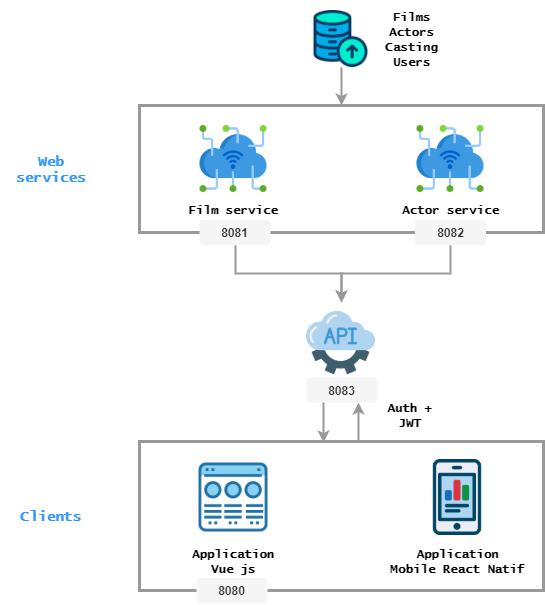

# Polywood API

You can find **API documentation** [there](API.md)


### Introduction

This an API for Polywood project that communicate with 2 services :
> [Movies service](https://github.com/PolywoodOrganization/polywood-film-service)

> [Actors service](https://github.com/PolywoodOrganization/polywood-actor-service)

This API allow to fetch movies and actors from a bolywood database.
This database has been created from IMDB data with [Talend](#https://fr.talend.com/) software.

    API port : 8083

#### Technologies

    Spring Boot
    MySQL
    Maven

#### Launch

In order to launch this API on your computer you must :
- create locally a `polywood` database and import [polywood.sql](#polywood.sql) script
- launch `polywood-film-service` application
- launch `polywood-actor-service` application

#### Connect and JWT

Every client application that aims to connect to the API must :
- connect in the login page
- save the token response
- give the token for every server request (put it in the body)

Login and password default to connect :

```
Login: Lea
Password: secret
```

*Password is hashed in database with SHA256.*


#### Whole polywood project Organization



Icons credits to :
[Kiranshastry](https://www.flaticon.com/authors/kiranshastry)
[Smashicons](https://www.flaticon.com/authors/smashicons)
[Freepik](https://www.flaticon.com/authors/freepik)
[Srip](https://www.flaticon.com/authors/srip)
[Smartline](https://www.flaticon.com/authors/smartline)
[Dimitry Miroliubov](https://www.flaticon.com/authors/dimitry-miroliubov)
